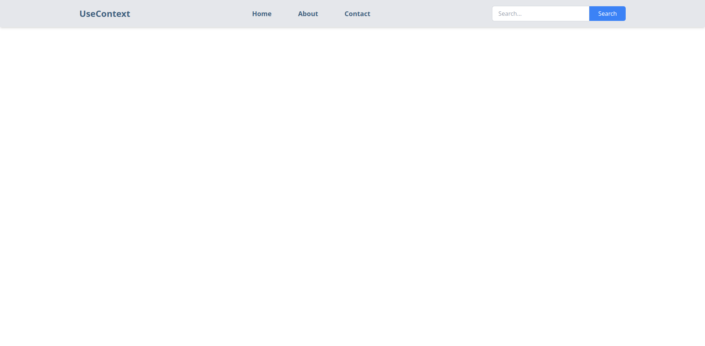

To create a navbar with links for "Home," "About," and "Contact" along with a search functionality button, you can use React and implement state management using Context API. 🏡 First, set up the context using NoteContext and then manage state in NoteState. 🚀 You will import this context into the About.jsx component to update values using an update function from NoteState. ⚽

In NoteState, you will create the necessary functions and provide values to the context provider. 🌟 In About.jsx, you will use the context to manage state changes dynamically. ☘️ This allows for seamless updates across your application when the update function is called, showcasing the usage of React's Context API for state management in a functional navbar with search capabilities. 🎐

